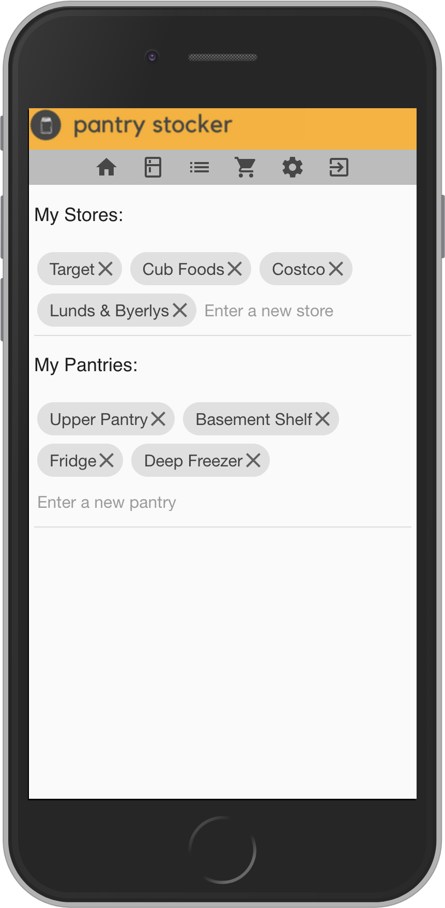
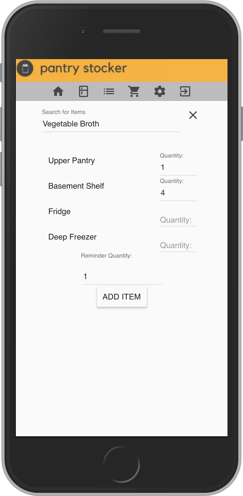
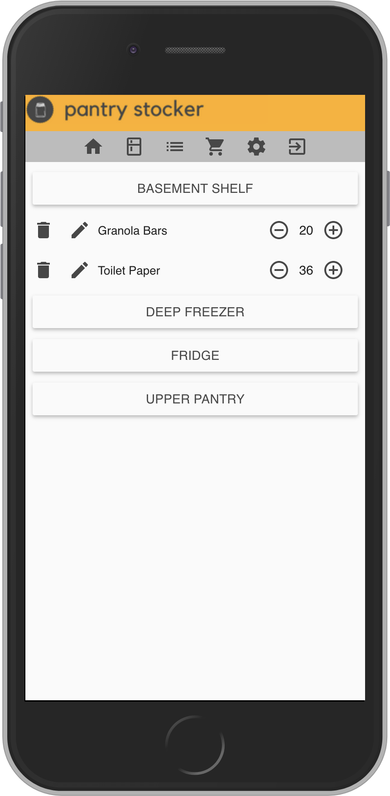
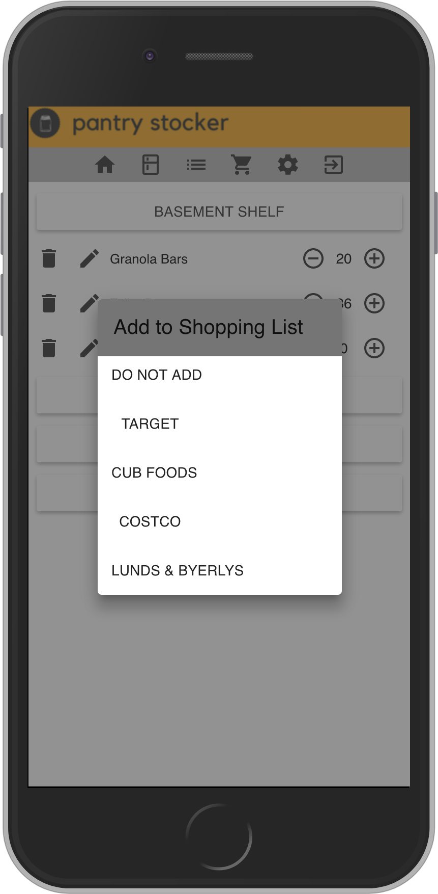

### Pantry Stocker

Built to be a solution for tracking the items in your pantry and other food storage spots in your home. This allows you to keep track of item locations, total quantities on hand, and automate the creation of shopping lists.

https://pantry-stocker.herokuapp.com/#/home

Demo it with:
Username: sample
Password: user

## Built With

- PostgreSQL
- Express
- Angular JS
- Node.js
- Angular Material

## Getting Started

Get started by forking and cloning this repository.

### Prerequisites

- [Node.js](https://nodejs.org/en/)

### Installing

Steps to get the development environment running.
1. Fork and clone this repository
2. Run npm install 
3. PostgreSQL: See pantry-stocker.sql for database structure
4. Run npm start
5. Go to http://localhost:5000 in your browser

### Completed Features

- [x] Items are added manually and searching is based on users current database items
- [x] Item minimum stock amount requirements trigger shopping lists notifications
- [x] Shopping list allows users to put in desired quantity and amount purchased
- [x] User can click done shopping update where items are put in their pantry lists

### Next Steps

- [ ] Filestack integration to allow users to upload pictures of their pantry items
- [ ] Expiration dates for items in the fridge
- [ ] Google Authentication

## Deployment

See above notes on installing.

## Authors

Sarah Harrington

